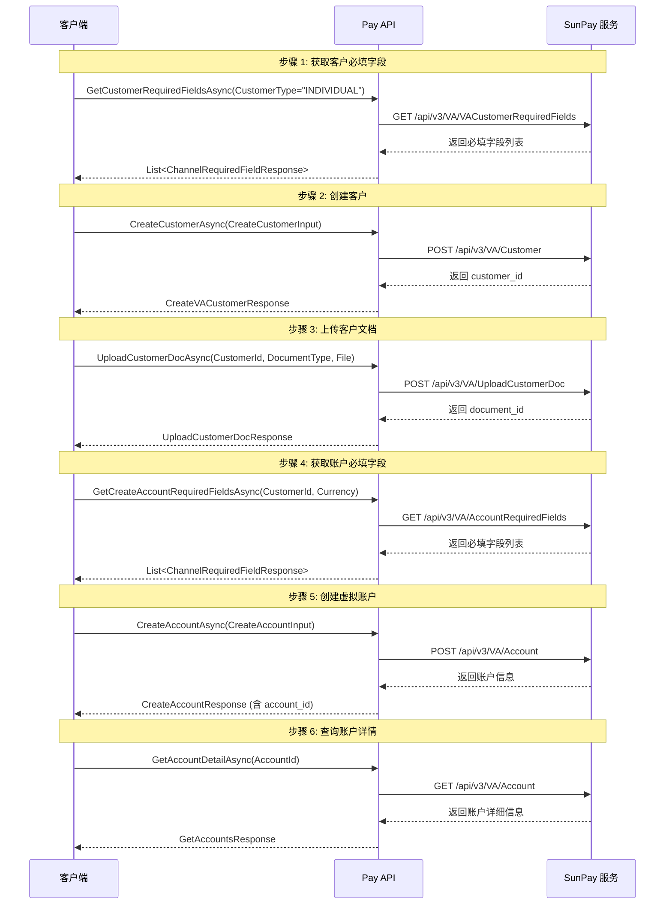
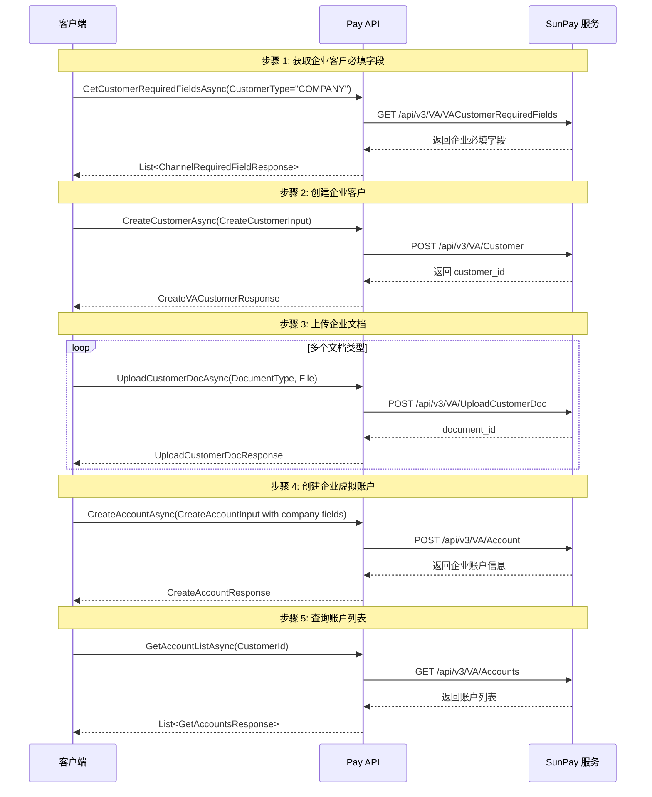
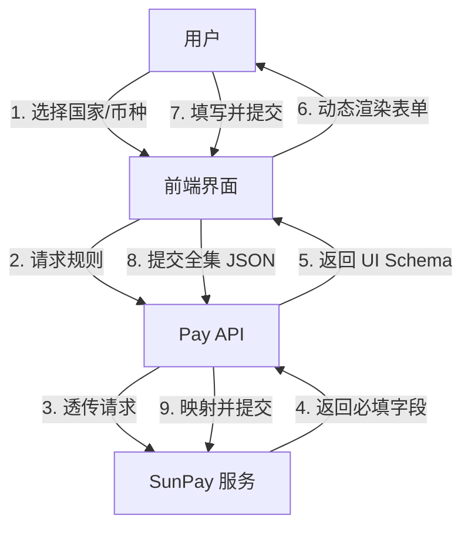

# Pay 模块接口清单与业务流程

## 📋 接口总览

Pay 模块提供虚拟账户（Virtual Account）管理功能，分为两大核心模块：

### 🔹 User Management (用户管理)
| 接口方法 | HTTP 方法 | API 路径 | 功能描述 |
|---------|----------|---------|---------|
| `GetCustomerRequiredFieldsAsync` | GET | `/api/v3/VA/VACustomerRequiredFields` | 获取创建客户所需的必填字段 |
| `CreateCustomerAsync` | POST | `/api/v3/VA/Customer` | 创建虚拟账户客户 |
| `QueryCustomerAsync` | GET | `/api/v3/VA/Customer` | 查询客户信息 |
| `UploadCustomerDocAsync` | POST | `/api/v3/VA/UploadCustomerDoc` | 上传客户身份证明文档 |

### 🔹 Account Management (账户管理)
| 接口方法 | HTTP 方法 | API 路径 | 功能描述 |
|---------|----------|---------|---------|
| `GetCreateAccountRequiredFieldsAsync` | GET | `/api/v3/VA/AccountRequiredFields` | 获取创建账户所需的必填字段 |
| `CreateAccountAsync` | POST | `/api/v3/VA/Account` | 创建虚拟账户（支持个人/企业） |
| `GetAccountListAsync` | GET | `/api/v3/VA/Accounts` | 获取客户的账户列表 |
| `GetAccountDetailAsync` | GET | `/api/v3/VA/Account` | 获取账户详细信息 |

---

## 🔄 完整业务流程

### 流程 1: 创建个人虚拟账户



### 流程 2: 创建企业虚拟账户



---

## 📝 接口详细说明

### 1. GetCustomerRequiredFieldsAsync

**功能**: 获取创建客户时的必填字段列表

**请求参数** (`GetCustomerRequiredFieldsInput`):
```csharp
{
    CustomerType: "INDIVIDUAL" | "COMPANY",  // 客户类型
    CountryCode: "US" | "GB" | ...           // 国家代码
}
```

**响应** (`List<ChannelRequiredFieldResponse>`):
```json
[
    {
        "field_name": "first_name",
        "required": true,
        "value": {
            "type": "string",
            "max_length": 100
        }
    }
]
```

---

### 2. CreateCustomerAsync

**功能**: 创建虚拟账户客户（个人或企业）

**请求参数** (`CreateCustomerInput`):
```csharp
{
    CustomerType: "INDIVIDUAL" | "COMPANY",
    CustomerEmail: "user@example.com",
    OutUserId: "YOUR_USER_ID",              // 您系统中的用户 ID
    CountryCode: "US"
}
```

**响应** (`CreateVACustomerResponse`):
```json
{
    "customer_id": "550e8400-e29b-41d4-a716-446655440000",
    "email": "user@example.com",
    "status": "Submitted",
    "action": "redirect_authentication",     // 可能需要额外认证
    "href": "https://auth.sunpay.pro/..."   // 认证链接
}
```

---

### 3. UploadCustomerDocAsync

**功能**: 上传客户身份证明文档

**请求参数** (`UploadCustomerDocInput`):
```csharp
{
    CustomerId: "550e8400-e29b-41d4-a716-446655440000",
    DocumentType: "PASSPORT" | "DRIVERS_LICENCE_FRONT" | "IDENTITY_CARD_FRONT" | ...,
    FileStream: Stream,                      // 文件流
    FileName: "passport.jpg"
}
```

**响应** (`UploadCustomerDocResponse`):
```json
{
    "document_id": "660e8400-e29b-41d4-a716-446655440001"
}
```

**支持的文档类型**:
- `PASSPORT` - 护照
- `DRIVERS_LICENCE_FRONT` / `DRIVERS_LICENCE_BACK` - 驾驶证正反面
- `IDENTITY_CARD_FRONT` / `IDENTITY_CARD_BACK` - 身份证正反面
- `BANK_STATEMENT` - 银行对账单
- `UTILITY_BILL` - 水电费账单
- `LEASE_AGREEMENT` - 租赁协议
- `PAYSLIP` - 工资单
- `ACCOUNT_AGREEMENT` - 账户协议

---

### 4. QueryCustomerAsync

**功能**: 查询客户信息

**请求参数** (`QueryCustomerInput`):
```csharp
{
    CustomerId: "550e8400-e29b-41d4-a716-446655440000",  // 可选
    OutUserId: "YOUR_USER_ID"                            // 可选
}
```

**响应** (`GetVACustomerResponse`):
```json
{
    "customer_id": "550e8400-e29b-41d4-a716-446655440000",
    "customer_email": "user@example.com",
    "customer_type": "INDIVIDUAL",
    "status": "Active",
    "country_code": "US"
}
```

---

### 5. GetCreateAccountRequiredFieldsAsync

**功能**: 获取创建账户时的必填字段列表

**请求参数** (`GetAccountRequiredFieldsInput`):
```csharp
{
    CustomerId: "550e8400-e29b-41d4-a716-446655440000",
    Currency: "USD" | "EUR" | "GBP" | ...
}
```

**响应** (`List<ChannelRequiredFieldResponse>`):
```json
[
    {
        "field_name": "first_name",
        "required": true,
        "value": {
            "type": "string"
        }
    }
]
```

---

### 6. CreateAccountAsync

**功能**: 创建虚拟账户（支持个人和企业）

**请求参数** (`CreateAccountInput`):

**个人账户示例**:
```csharp
{
    Currency: "USD",
    CustomerId: "550e8400-e29b-41d4-a716-446655440000",
    
    // 个人信息
    FirstName: "John",
    LastName: "Doe",
    Email: "john.doe@example.com",
    Phone: "+1234567890",
    BirthDate: "1990-01-01",
    BirthCountry: "US",
    
    // 地址信息
    AddressLine: "123 Main St",
    City: "New York",
    State: "NY",
    PostCode: "10001",
    CountryCode: "US",
    
    // 财务信息
    EmploymentStatus: "EMPLOYED",
    Occupation: "Software Engineer",
    MonthlyDeposits: "5000",
    
    // 文档 ID
    PassportDocumentId: "660e8400-...",
    BankStatementDocumentId: "770e8400-..."
}
```

**企业账户示例**:
```csharp
{
    Currency: "USD",
    CustomerId: "550e8400-e29b-41d4-a716-446655440000",
    
    // 企业信息
    CompanyName: "Tech Corp Inc",
    RegistrationNumber: "REG123456",
    CompanyRegistrationDate: "2020-01-01",
    CompanyType: "LIMITED_LIABILITY",
    
    // 企业地址
    AddressLine: "456 Business Ave",
    City: "San Francisco",
    State: "CA",
    PostCode: "94102",
    CountryCode: "US",
    
    // 业务人员信息
    BusinessPersonFirstName: "Jane",
    BusinessPersonLastName: "Smith",
    BusinessPersonOwnership: 51.0,
    
    // 企业文档 ID
    CompanyIncorporationDocumentId: "880e8400-...",
    CompanyBankStatementDocumentId: "990e8400-..."
}
```

**响应** (`CreateAccountResponse`):
```json
{
    "customer_id": "550e8400-e29b-41d4-a716-446655440000",
    "account_id": "ACC-USD-12345",
    "currency": "USD",
    "status": "Submitted",
    "action": "pending_review",
    "first_name": "John",
    "last_name": "Doe",
    "email": "john.doe@example.com"
}
```

---

### 7. GetAccountListAsync

**功能**: 获取客户的所有虚拟账户列表

**请求参数** (`GetAccountListInput`):
```csharp
{
    CustomerId: "550e8400-e29b-41d4-a716-446655440000"
}
```

**响应** (`List<GetAccountsResponse>`):
```json
[
    {
        "account_id": "ACC-USD-12345",
        "currency": "USD",
        "balance": 1000.50,
        "status": "Active",
        "routing_codes": [
            {
                "routing_code_type": "ACH",
                "routing_code_value": "123456789"
            }
        ]
    }
]
```

---

### 8. GetAccountDetailAsync

**功能**: 获取指定账户的详细信息

**请求参数**:
```csharp
{
    AccountId: "ACC-USD-12345",
    InvitationCode: "YOUR_MERCHANT_CODE"
}
```

**响应** (`GetAccountsResponse`):
```json
{
    "account_id": "ACC-USD-12345",
    "currency": "USD",
    "balance": 1000.50,
    "status": "Active",
    "routing_codes": [...],
    "deposit_instructions": {
        "ACH": {
            "routing_number": "123456789",
            "account_number": "987654321"
        },
        "WIRE": {
            "swift_code": "ABCDUS33",
            "account_number": "987654321"
        }
    }
}
```

---

## 💡 使用示例

### 示例 1: 创建个人账户完整流程

```csharp
// 1. 获取必填字段
var requiredFields = await payClient.GetCustomerRequiredFieldsAsync(
    new GetCustomerRequiredFieldsInput 
    { 
        CustomerType = "INDIVIDUAL",
        CountryCode = "US"
    }, 
    invitationCode
);

// 2. 创建客户
var customer = await payClient.CreateCustomerAsync(
    new CreateCustomerInput
    {
        CustomerType = "INDIVIDUAL",
        CustomerEmail = "john@example.com",
        OutUserId = "USER_123",
        CountryCode = "US"
    },
    invitationCode
);

// 3. 上传护照
var passportDoc = await payClient.UploadCustomerDocAsync(
    new UploadCustomerDocInput
    {
        CustomerId = customer.Data.CustomerId.ToString(),
        DocumentType = "PASSPORT",
        FileStream = passportFileStream,
        FileName = "passport.jpg"
    },
    invitationCode
);

// 4. 创建账户
var account = await payClient.CreateAccountAsync(
    new CreateAccountInput
    {
        Currency = "USD",
        CustomerId = customer.Data.CustomerId.ToString(),
        FirstName = "John",
        LastName = "Doe",
        Email = "john@example.com",
        Phone = "+1234567890",
        BirthDate = "1990-01-01",
        AddressLine = "123 Main St",
        City = "New York",
        State = "NY",
        PostCode = "10001",
        CountryCode = "US",
        PassportDocumentId = passportDoc.Data.DocumentId.ToString()
    },
    invitationCode
);

// 5. 查询账户详情
var accountDetail = await payClient.GetAccountDetailAsync(
    account.Data.AccountId,
    invitationCode
);
```

---

## 🔐 认证机制

所有接口都使用 HMAC-SHA256 签名认证：

**请求头**:
- `SunPay-Key`: 商户密钥
- `SunPay-Timestamp`: Unix 时间戳（毫秒）
- `SunPay-Nonce`: 随机字符串
- `SunPay-Sign`: HMAC-SHA256(timestamp + nonce + body)

**签名生成**:
```csharp
var payload = timestamp + nonce + requestBody;
var signature = HMACSHA256(payload, merchantSecret).ToUpperHex();
```

---

## 📊 状态说明

### 客户状态 (Customer Status)
- `Submitted` - 已提交，等待审核
- `Active` - 已激活
- `Suspended` - 已暂停
- `Rejected` - 已拒绝

### 账户状态 (Account Status)
- `Submitted` - 已提交，等待审核
- `Active` - 已激活，可以使用
- `Suspended` - 已暂停
- `Closed` - 已关闭

### 动作类型 (Action)
- `redirect_authentication` - 需要重定向到认证页面
- `pending_review` - 等待人工审核
- `approved` - 已批准
- `rejected` - 已拒绝

---

## ⚠️ 注意事项

1. **文档上传顺序**: 必须先创建客户，获得 `customer_id` 后才能上传文档
2. **账户创建前提**: 必须先创建客户并上传必要的身份证明文档
3. **币种限制**: 每个账户只能有一种币种，如需多币种需创建多个账户
4. **必填字段**: 不同国家和币种的必填字段可能不同，建议先调用 `GetCustomerRequiredFieldsAsync` 和 `GetCreateAccountRequiredFieldsAsync`
5. **文档格式**: 支持 JPG、PNG、PDF 格式，单个文件不超过 10MB
6. **认证流程**: 某些情况下可能需要额外的身份认证，注意检查响应中的 `action` 和 `href` 字段

---

## 🎯 最佳实践

1. **错误处理**: 始终检查 `PayApiResponse.IsSuccess` 和 `Code`
2. **幂等性**: 使用 `OutUserId` 作为幂等键，避免重复创建客户
3. **文档管理**: 保存 `document_id` 以便后续引用
4. **状态轮询**: 对于异步操作，定期调用 `QueryCustomerAsync` 或 `GetAccountDetailAsync` 检查状态
5. **日志记录**: 记录所有 API 调用的请求和响应，便于问题排查

---

## 🏗️ 最佳实践：动态业务逻辑与 To-C 架构设计

针对 To-C 场景下多维度（国家 x 币种 x 账户类型）的复杂业务需求，建议采用 **"元数据驱动 (Metadata-Driven)"** 和 **"动态表单引擎 (Dynamic Form Engine)"** 的设计模式。

### 1. 核心理念

- **后端提供规则 (Rules Provider)**: 后端不硬编码业务逻辑，而是透传 SunPay 的规则接口 (`GetRequiredFields`)。
- **前端动态渲染 (Dynamic Rendering)**: 前端根据后端返回的元数据（字段名、类型、必填项），即时生成表单界面。
- **全集 DTO (Superset DTO)**: 使用统一的 DTO (`CreateCustomerInput`, `CreateAccountInput`) 接收所有类型的提交，后端自动忽略无关字段。

### 2. 架构设计图



### 3. 动态表单引擎流程 (Dynamic Form Engine Flow)

#### 场景：用户开通英国 GBP 个人账户

1.  **初始化 (Initialization)**
    - 用户在 APP 选择：国家="United Kingdom", 币种="GBP", 类型="Individual"。

2.  **获取规则 (Fetch Rules)**
    - 前端调用：`GET /api/v3/VA/AccountRequiredFields?country=GB&currency=GBP`
    - 后端返回：
      ```json
      [
        { "field_name": "sort_code", "type": "text", "required": true, "label": "Sort Code" },
        { "field_name": "account_number", "type": "text", "required": true, "label": "Account Number" }
      ]
      ```

3.  **动态渲染 (Render)**
    - 前端组件库遍历 JSON，自动生成 "Sort Code" 和 "Account Number" 输入框。
    - **优势**: 如果 SunPay 增加新字段，无需发版，前端自动适配。

4.  **数据组装 (Assembly)**
    - 用户填写数据。
    - 前端组装 JSON：
      ```json
      {
        "currency": "GBP",
        "country_code": "GB",
        "sort_code": "12-34-56",
        "account_number": "12345678"
      }
      ```

5.  **统一提交 (Submission)**
    - 前端调用：`POST /api/v3/VA/Account`
    - 后端接收 `CreateAccountInput`，将 JSON 映射到对应属性，未涉及的属性（如 `swift_code`）保持为 `null`。

### 4. 为什么选择这种架构？

1.  **零代码扩展 (Zero-Code Expansion)**: 新增国家或币种业务时，只需配置，无需修改前后端代码。
2.  **低错误率 (Low Error Rate)**: 表单字段完全由 API 定义，杜绝漏填或多填。
3.  **原生体验 (Native Experience)**: 虽然逻辑动态，但使用原生 UI 组件渲染，用户体验流畅。
4.  **维护简单 (Easy Maintenance)**: 业务逻辑收敛于 SunPay 规则，中间层只需做好透传和映射。
